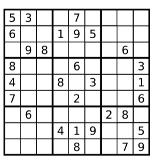

# Valid Sudoku

Created: 2025年4月12日 下午1:52
Question Type: Array
Difficulty: Medium
LeetCode Question Link: https://leetcode.com/problems/valid-sudoku/description/

# **1. Question Self-understanding:**

## 1.1 Description:

Based on my understanding, I need to ensure that each row, column, and 3x3 sub-grid of the Sudoku board contains numbers from 1 to 9 with no duplicates.

## 1.2 Input:

The input type will be a list of lists of strings, where the outer list represents the entire 9x9 Sudoku board, and each inner list represents a single row.

## 1.3 Input Assumption

Each cell will contain either a number from 1 to 9 as a string or a '.' character representing an empty cell.

- This means we don't need to validate if the given string contains numbers outside the range 1-9, simplifying the identification of empty cells.

## 1.4 Output:

The output should be a boolean.

## 1.5 Example:



```
Input: board =
[["5","3",".",".","7",".",".",".","."]
,["6",".",".","1","9","5",".",".","."]
,[".","9","8",".",".",".",".","6","."]
,["8",".",".",".","6",".",".",".","3"]
,["4",".",".","8",".","3",".",".","1"]
,["7",".",".",".","2",".",".",".","6"]
,[".","6",".",".",".",".","2","8","."]
,[".",".",".","4","1","9",".",".","5"]
,[".",".",".",".","8",".",".","7","9"]]
Output: true
```

## 1.6 Other Q&A:

- None for this question.

# 2. Attempt 1:

## 2.1 Thought:

- We must primarily ensure there are no duplicates in rows, columns, and sub-grids. Using sets is the most efficient way to check duplicates. We'll need three sets: one for rows, one for columns, and one for sub-grids. Checking rows and columns is straightforward, but sub-grids require nested loops. Each 3x3 sub-grid can be identified by row and column indices multiplied by 3. For instance, the central cell of the sub-grid at index (0,1) can be identified by row `0 * 3 + 1` and column `1 * 3 + 1`.

## 2.2 Pseudo-Code: (Ignore this part. Only for myself to code)

```python
class Solution:
    def isValidSudoku(self, board: List[List[str]]) -> bool:
        # Let's initial three sets.
        row_set = set();
        col_set = set();
        sub_Suduko_set = set();
        
	      # check row part
	      for-loop through the row:
		      for-loop through the column:
			      check if the current value in the column in the row_set
					     if yes:
						     return false
					reset the row_set
				
				for-loop through the column:
		      for-loop through the row:
			      check if the current value in the column in the col_set
					     if yes:
						     return false
					reset the col_set
		
		
				row_index = 0
				col_index = 0
				
				while-loop the row_index until row_index equal 3.
					while-loop the col_index until col_index equal 3
							
							check the ceel whether inside the sub_suduko_set:
								if yes:
									return false
								
							
						
						add 1 to the column index
					add 1 to the row_index
					reset_sub_suduko_set
					
				return true
```

## 2.3 Implementation through python:

```python
from typing import List

class Solution:
    def isValidSudoku(self, board: List[List[str]]) -> bool:
        # Check each row for duplicate numbers.
        for i in range(9):
            seen = set()
            for j in range(9):
                if board[i][j] != '.':
                    if board[i][j] in seen:
                        return False
                    seen.add(board[i][j])
        
        # Check each column for duplicate numbers.
        for j in range(9):
            seen = set()
            for i in range(9):
                if board[i][j] != '.':
                    if board[i][j] in seen:
                        return False
                    seen.add(board[i][j])
        
        # Check each 3x3 sub-box for duplicate numbers.
        for box_row in range(3):
            for box_col in range(3):
                seen = set()
                for i in range(box_row * 3, box_row * 3 + 3):
                    for j in range(box_col * 3, box_col * 3 + 3):
                        if board[i][j] != '.':
                            if board[i][j] in seen:
                                return False
                            seen.add(board[i][j])
        return True

```

## 2.4 Time Complexity and Space Complexity

### 2.4.1 Time Complexity:

- Each cell is checked exactly three times (row, column, sub-grid), giving a time complexity of $O(3n)$, simplified to $O(n)$.

### 2.4.2 Space Complexity:

- Each cell is temporarily stored three times (row, column, sub-grid), resulting in a space complexity of $O(3n)$
 , simplified to $O(n)$.