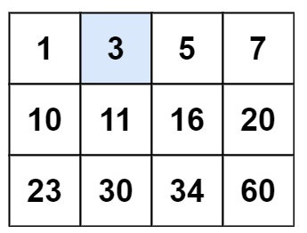

# Search a 2D Matrix

Created: 2025年5月12日 下午1:05
Question Type: Binary Search
Difficulty: Medium
LeetCode Question Link: https://leetcode.com/problems/search-a-2d-matrix/description/

# **1. Question Self-understanding:**

## 1.1 Description:

We must determine whether a given value appears in an `m × n` matrix (i.e., a 2-D list) that obeys two ordering properties.

## 1.2 Input:

- `matrix : List[List[int]]` — a nested list representing the 2-D matrix.
- `target : int` — the value to search for.

## 1.3 Input Assumption

1. Each row is sorted in **non-decreasing** order.
2. The first element of every row is **strictly greater** than the last element of the previous row.
3. Matrix dimensions satisfy `1 ≤ m, n ≤ 100`; the smallest legal matrix is therefore 1 × 1.

These properties let us treat the entire matrix as one strictly increasing array of length `m · n`

## 1.4 Output:

Return a Bool:

- **`True`** if `target` exists in the matrix,
- **`False`** otherwise.

## 1.5 Example:



```
Input: matrix = [[1,3,5,7],[10,11,16,20],[23,30,34,60]], target = 3
Output: true
```

## 1.6 Other Q&A:

- None for this question.

# 2. Attempt 1:

## 2.1 Thought:

Because of property 2, each row forms a “bucket” whose values are all larger than any value in the previous row.

We therefore perform *two* binary searches:

1. **Row selection** – locate the unique row whose range could contain `target`.
2. **Column search** – binary-search inside that row.

## 2.2 Pseudo-Code: (**Ignore this part. It’s a draft for brainstorming.**)

```python
SEARCH-MATRIX(A, t)
    ── Row (bucket) selection ────────────────────────────
    low  ← 1
    high ← number-of-rows(A)
    while low ≤ high do
        mid ← ⌊(low + high)/2⌋
        if A[mid, n] < t            ▹ last element too small
            low ← mid + 1
        else if A[mid, 1] > t       ▹ first element too large
            high ← mid − 1
        else                        ▹ row 'mid' may contain t
            row* ← mid
            break
    if low > high                   ▹ no feasible row found
        return FALSE

    ── Column search inside row* ─────────────────────────
    low  ← 1
    high ← number-of-columns(A)
    while low ≤ high do
        mid ← ⌊(low + high)/2⌋
        if A[row*, mid] = t
             return TRUE
        else if A[row*, mid] < t
             low ← mid + 1
        else
             high ← mid − 1
    return FALSE

```

## 2.3 Implementation through python:

```python
from typing import List

class Solution:
    def searchMatrix(self, matrix: List[List[int]], target: int) -> bool:
        if not matrix or not matrix[0]:
            return False

        m, n = len(matrix), len(matrix[0])

        # ── 1. Row selection ──
        top, bot = 0, m - 1
        while top <= bot:
            mid_row = (top + bot) // 2
            if matrix[mid_row][-1] < target:       # target is larger
                top = mid_row + 1
            elif matrix[mid_row][0] > target:      # target is smaller
                bot = mid_row - 1
            else:                                  # found candidate row
                break

        if top > bot:                              # no row fits
            return False
        row = (top + bot) // 2                     # candidate row index

        # ── 2. Column search ──
        left, right = 0, n - 1
        while left <= right:
            mid_col = (left + right) // 2
            val = matrix[row][mid_col]
            if val == target:
                return True
            elif val < target:
                left = mid_col + 1
            else:
                right = mid_col - 1

        return False

```

## 2.4 Time Complexity and Space Complexity

### 2.4.1 Time Complexity:

- First binary search over `m` rows, second over `n` columns. The time complexity will be $O(log(m) + log(n)) == O((log(mn))$

### 2.4.2 Space Complexity:

- Only constant-size index variables are used. So, the space complexity is $O(1)$