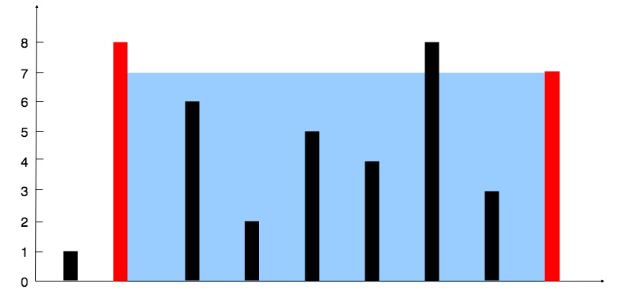

# Container With Most Water

Created: 2025年4月14日 下午1:38
Question Type: Two Pointers
Difficulty: Medium
LeetCode Question Link: https://leetcode.com/problems/container-with-most-water/description/

# **1. Question Self-understanding:**

## 1.1 Description:

Based on my understanding, the goal is to find two endpoint walls that can contain the maximum amount of water when selected together.

## 1.2 Input:

The input will be a list of integers, where each integer represents the height of a wall.

## 1.3 Input Assumption

- The height of each wall is at least 0.
- There should be at least 2 walls.

## 1.4 Output:

The output should be an array with two integers representing the heights of the selected walls.

## 1.5 Example:



```
Input: height = [1,8,6,2,5,4,8,3,7]
Output: 49
```

## 1.6 Other Q&A:

**Question 1:**

Is it possible for a wall between the two selected endpoints to block or cut off the water?

**Answer 1:**

No, it will be ignored and won’t cut off the water, as shown in the example diagram above.

# 2. Attempt 1:

## 2.1 Thought:

- First, it might seem like a good idea to consider all possible pairs of endpoints. However, this immediately suggests the two-pointer technique: start with one pointer at each end and then move them inward. The key question is under what conditions do we move a pointer, and how do we know this might yield a better result?
    
    In this problem, we cannot sort the walls because their order matters, so data structures like a hash set won’t be useful here.
    
- Let’s discuss when to move one of the pointers:
    - If one side is taller than the other, should we move that pointer or the shorter one?
        - Generally, we move the pointer at the shorter wall inward because the water level is determined by the shorter wall. Even if there’s a taller wall in the middle, it won’t help if we continue to keep the smaller wall as one endpoint.
    - The immediate approach is:
        1. Calculate the area by taking the minimum of the two endpoints’ heights and multiplying it by the distance between them.
        2. Compare this area to the maximum area found so far and update if larger.
        3. Move the pointer that points to the shorter wall, hoping to find a taller wall that can help increase the area.
        4. Continue until the two pointers meet.

## 2.2 Pseudo-Code: (**Ignore this part. It’s a draft for brainstorming.**)

```python
class Solution:
    def maxArea(self, height: List[int]) -> int:
        # Initialize left and right pointers, and the result
        # While left is less than right:
            # Calculate the current area
            # Move the pointer at the shorter wall inward
            # Update the result with the maximum of the current area and the previous best
        # Return the final result

```

## 2.3 Implementation through python:

```python
class Solution:
    def maxArea(self, height: List[int]) -> int:
        # intialize the left and right pointers
        left = 0
        right = len(height) - 1
        # intialize the max area to 0
        max_area = 0
        # while the left pointer is less than the right pointer
        while left < right:
            # calculate the current area
            # update the max area if the current area is greater than the max area
            max_area = max(max_area, min(height[left], height[right]) * (right - left))
            # move the pointer with the smaller height towards the other pointer
            if height[left] < height[right]:
                left += 1
            else:
                right -= 1
        return max_area
```

## 2.4 Time and Space Complexity

### 2.4.1 Time Complexity

- Each pointer moves at most once across the array, so the total time complexity is **O(n)**.

### 2.4.2 Space Complexity

- We don't use any additional data structures, so the extra space complexity is **O(1)**.